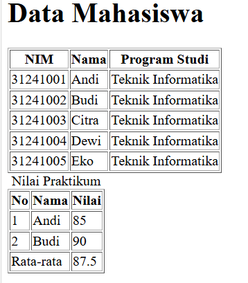
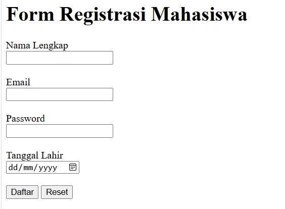
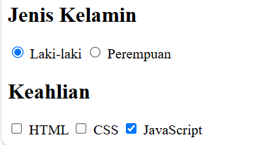

# Lab2Web

Belajar membuat tabel, form, input, semantic HTML, multimedia, dan validasi form dasar.

## Membuat Tabel Mahasiswa

Pada langkah pertama dibuat tabel untuk menampilkan data mahasiswa menggunakan beberapa elemen HTML:

- `<table>` untuk membuat tabel.
- `<tr>` untuk membuat baris.
- `<th>` untuk membuat judul kolom.
- `<td>` untuk membuat data pada tabel.

### Result

## Mengembangkan Tabel

Pada langkah ini tabel dikembangkan menggunakan beberapa elemen HTML:

- `<caption>` untuk memberikan judul tabel.
- `<thead>` untuk bagian kepala tabel.
- `<tbody>` untuk bagian isi tabel.
- `<tfoot>` untuk bagian kaki atau ringkasan tabel.
- `colspan` untuk menggabungkan beberapa kolom.

### Result

## Membuat form registrasi

Form digunakan untuk menerima data dari pengguna.

Input yang digunakan antara lain:
- Nama lengkap.
- Email.
- Password.
- Tanggal lahir.
- Tombol Daftar.
- Tombol Reset.

### Result

## Radio Button dan Checkbox

Radio button digunakan untuk memilih satu pilihan dari beberapa pilihan yang tersedia.

Contohnya adalah pilihan jenis kelamin:
- Laki-laki.
- Perempuan.
- Checkbox digunakan untuk memilih satu atau lebih pilihan.
- Contohnya adalah keahlian:
- HTML.
- CSS.
- JavaScript.

### Result

## Select dan Textarea

Elemen <select> digunakan untuk membuat pilihan berupa dropdown.
Program studi yang tersedia:
Teknik Informatika.
Sistem Informasi.
Elemen <textarea> digunakan untuk menerima teks yang lebih panjang, seperti alamat.

### Result

