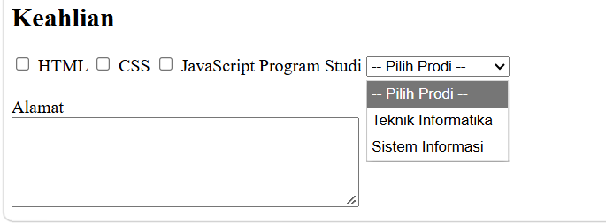
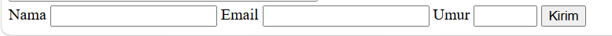
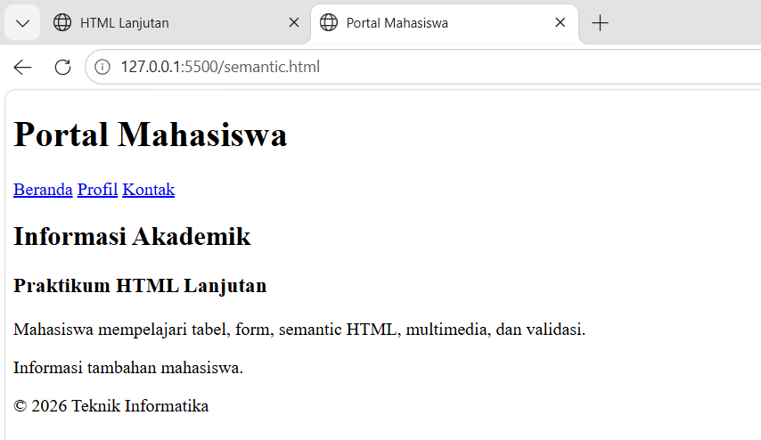
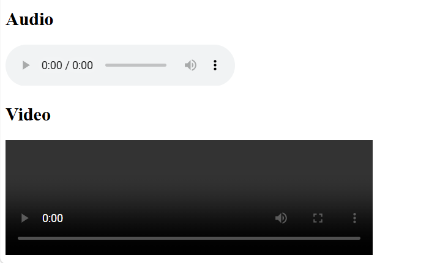
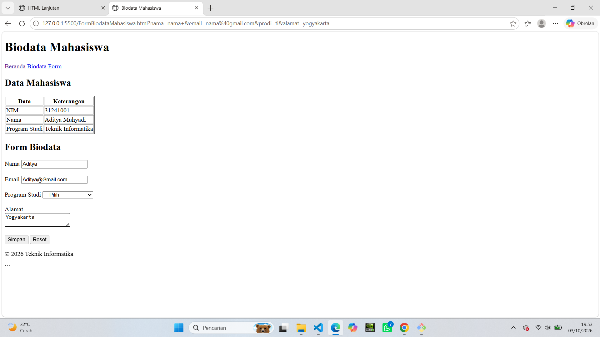

# Lab2Web

Praktikum ini membahas dasar-dasar HTML lanjutan, meliputi pembuatan tabel, form, input, semantic HTML, multimedia, serta validasi form dasar.

## Membuat Tabel Mahasiswa

Pada langkah pertama, dibuat tabel untuk menampilkan data mahasiswa menggunakan beberapa elemen HTML:

- `<table>` digunakan untuk membuat tabel.
- `<tr>` digunakan untuk membuat baris tabel.
- `<th>` digunakan untuk membuat judul kolom.
- `<td>` digunakan untuk membuat data pada tabel.

### Result


---

## Mengembangkan Tabel

Pada langkah ini, tabel dikembangkan dengan menggunakan beberapa elemen HTML:

- `<caption>` digunakan untuk memberikan judul tabel.
- `<thead>` digunakan untuk bagian kepala tabel.
- `<tbody>` digunakan untuk bagian isi tabel.
- `<tfoot>` digunakan untuk bagian kaki atau ringkasan tabel.
- `colspan` digunakan untuk menggabungkan beberapa kolom.

### Result


---

## Membuat Form Registrasi

Form digunakan untuk menerima data dari pengguna.

Input yang digunakan antara lain:

- Nama lengkap.
- Email.
- Password.
- Tanggal lahir.
- Tombol Daftar.
- Tombol Reset.

### Result


---

## Radio Button dan Checkbox

Radio button digunakan untuk memilih satu pilihan dari beberapa pilihan yang tersedia.

Contohnya adalah pilihan jenis kelamin:

- Laki-laki.
- Perempuan.

Checkbox digunakan untuk memilih satu atau lebih pilihan.

Contohnya adalah pilihan keahlian:

- HTML.
- CSS.
- JavaScript.

### Result


---

## Select dan Textarea

Elemen `<select>` digunakan untuk membuat pilihan dalam bentuk dropdown.

Program studi yang tersedia:

- Teknik Informatika.
- Sistem Informasi.

Elemen `<textarea>` digunakan untuk menerima teks yang lebih panjang, seperti alamat.

### Result



---

## Validasi Form Dasar

Validasi form dilakukan menggunakan beberapa atribut HTML, seperti:

- `required`
- `minlength`
- `min`
- `max`
- `type="email"`

Browser akan memberikan pesan validasi apabila pengguna menekan tombol Kirim tanpa memenuhi ketentuan yang telah ditentukan.

### Result



---

## Membuat Halaman Semantic HTML

Pada langkah ini digunakan beberapa elemen semantic HTML:

- `<header>`
- `<nav>`
- `<main>`
- `<section>`
- `<article>`
- `<aside>`
- `<footer>`

Semantic HTML membantu memberikan struktur dan makna yang lebih jelas pada halaman web.

### Result



---

## Menambahkan Multimedia

Pada praktikum ini ditambahkan elemen multimedia berupa audio dan video.

### Struktur Folder

```text
praktikum-2-html-lanjutan/
│
├── index.html
├── README.md
└── media/
    ├── audio.mp3
    └── video.mp4
```

Audio ditampilkan menggunakan elemen:

```html
<audio controls>
    <source src="media/audio.mp3" type="audio/mpeg">
    Browser tidak mendukung audio.
</audio>
```

Video ditampilkan menggunakan elemen:

```html
<video controls width="480">
    <source src="media/video.mp4" type="video/mp4">
    Browser tidak mendukung video.
</video>
```

### Result



---

## Proyek Mini — Biodata Mahasiswa

Pada proyek mini ini dibuat halaman biodata mahasiswa yang menggabungkan materi yang telah dipelajari.

Halaman memiliki beberapa bagian, yaitu:

- Semantic HTML.
- Tabel data mahasiswa.
- Form biodata.
- Validasi form.
- Select program studi.
- Textarea alamat.
- Multimedia.
- Navigasi halaman.

### Struktur Halaman

```html
<header>
    Judul halaman
</header>

<nav>
    Navigasi
</nav>

<main>
    <section>
        Data Mahasiswa
    </section>

    <section>
        Form Biodata
    </section>
</main>

<footer>
    Footer
</footer>
```

### Result



---

# Jawaban Pertanyaan

## 1. Apa fungsi `<table>`, `<tr>`, `<th>`, dan `<td>`?

- `<table>` digunakan untuk membuat sebuah tabel HTML.
- `<tr>` digunakan untuk membuat baris pada tabel.
- `<th>` digunakan untuk membuat sel header atau judul kolom.
- `<td>` digunakan untuk membuat sel yang berisi data tabel.

Contoh:

```html
<table>
    <tr>
        <th>Nama</th>
        <th>NIM</th>
    </tr>
    <tr>
        <td>Andi</td>
        <td>31241001</td>
    </tr>
</table>
```

---

## 2. Apa perbedaan `<th>` dan `<td>`?

`<th>` digunakan sebagai header atau judul kolom/baris, sedangkan `<td>` digunakan untuk menampilkan data.

Contoh:

```html
<th>Nama</th>
<td>Andi</td>
```

`Nama` merupakan judul kolom, sedangkan `Andi` merupakan data.

---

## 3. Apa fungsi `colspan` pada tabel?

`colspan` digunakan untuk menggabungkan beberapa kolom menjadi satu sel.

Contoh:

```html
<td colspan="2">Rata-rata</td>
```

Kode tersebut menggabungkan dua kolom menjadi satu.

---

## 4. Apa fungsi `<form>` dalam HTML?

`<form>` digunakan untuk membuat formulir yang memungkinkan pengguna memasukkan data.

Contohnya:

```html
<form>
    <input type="text" name="nama">
    <input type="email" name="email">
    <button type="submit">Kirim</button>
</form>
```

Form dapat digunakan untuk menerima data seperti nama, email, password, tanggal lahir, alamat, dan data lainnya.

---

## 5. Apa perbedaan radio button dan checkbox?

**Radio button** digunakan ketika pengguna hanya dapat memilih satu pilihan dari kelompok pilihan.

Contoh:

```html
<input type="radio" name="jk" value="L"> Laki-laki
<input type="radio" name="jk" value="P"> Perempuan
```

**Checkbox** digunakan ketika pengguna dapat memilih satu atau beberapa pilihan.

Contoh:

```html
<input type="checkbox" name="skill" value="HTML"> HTML
<input type="checkbox" name="skill" value="CSS"> CSS
<input type="checkbox" name="skill" value="JS"> JavaScript
```

---

## 6. Mengapa `<label>` sebaiknya terhubung dengan `id` input melalui atribut `for`?

Atribut `for` pada `<label>` dihubungkan dengan `id` pada input agar label memiliki hubungan yang jelas dengan input tersebut.

Contoh:

```html
<label for="nama">Nama</label>
<input type="text" id="nama" name="nama">
```

Dengan hubungan tersebut, pengguna dapat mengklik label untuk memfokuskan input yang terkait. Hal ini juga membantu aksesibilitas halaman web.

---

## 7. Apa perbedaan `<textarea>` dengan input type text?

`<input type="text">` biasanya digunakan untuk memasukkan teks yang relatif singkat dalam satu baris.

Contoh:

```html
<input type="text" name="nama">
```

Sedangkan `<textarea>` digunakan untuk memasukkan teks yang lebih panjang dan dapat terdiri dari beberapa baris.

Contoh:

```html
<textarea name="alamat"></textarea>
```

---

## 8. Apa fungsi semantic HTML seperti `<header>`, `<nav>`, `<main>`, `<section>`, `<article>`, `<aside>`, dan `<footer>`?

Semantic HTML digunakan untuk memberikan struktur dan makna yang lebih jelas pada halaman web.

- `<header>` → bagian kepala halaman atau bagian tertentu.
- `<nav>` → bagian navigasi.
- `<main>` → konten utama halaman.
- `<section>` → bagian atau kelompok konten yang memiliki tema tertentu.
- `<article>` → konten mandiri seperti artikel atau berita.
- `<aside>` → informasi tambahan atau konten sampingan.
- `<footer>` → bagian bawah halaman atau bagian tertentu.

Penggunaan elemen semantic membuat struktur HTML lebih mudah dipahami oleh developer, browser, dan teknologi bantu.

---

## 9. Apa fungsi `required`, `min`, `max`, dan `minlength`?

- `required` → membuat input wajib diisi.
- `min` → menentukan nilai minimum pada input angka.
- `max` → menentukan nilai maksimum pada input angka.
- `minlength` → menentukan jumlah karakter minimum.

Contoh:

```html
<input type="text" required minlength="3">

<input type="number" min="17" max="60">
```

Pada contoh tersebut, input pertama wajib diisi dan minimal memiliki tiga karakter. Input angka harus berada pada rentang 17 sampai 60.

---

## 10. Apa perbedaan elemen `<audio>` dan `<video>`?

`<audio>` digunakan untuk menampilkan dan memutar file suara atau audio.

Contoh:

```html
<audio controls>
    <source src="media/audio.mp3" type="audio/mpeg">
</audio>
```

Sedangkan `<video>` digunakan untuk menampilkan dan memutar video.

Contoh:

```html
<video controls width="480">
    <source src="media/video.mp4" type="video/mp4">
</video>
```

Perbedaan utamanya adalah `<audio>` digunakan untuk konten suara, sedangkan `<video>` digunakan untuk konten video.

---

# Kesimpulan

Pada Praktikum 2 telah dipelajari berbagai fitur HTML lanjutan, mulai dari pembuatan tabel, form, validasi, semantic HTML, hingga multimedia.

Melalui proyek mini biodata mahasiswa, seluruh materi tersebut digabungkan menjadi satu halaman web yang memiliki struktur semantic, tabel data, form biodata, validasi dasar, dan elemen multimedia.

Praktikum ini memberikan pemahaman dasar mengenai cara membangun halaman web yang memiliki struktur HTML yang lebih lengkap dan terorganisasi.