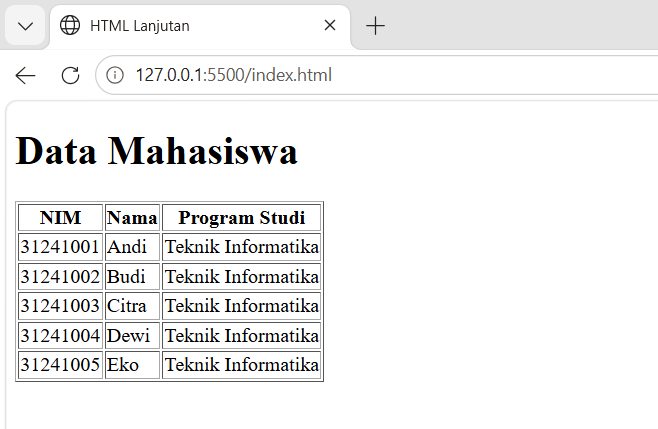

# Lab2Web
Belajar membuat tabel,form,input,semanticHTML,multimedia, dan validasi form dasar

## Membuat tabel maha siswa
Pada langkah pertama dibuat tabel untuk menampilkan data mahasiswa menggunakan elemen:
'<table>' untuk membuat tabel.
'<tr>' untuk membuat baris.
'<th>' untuk membuat judul kolom.
'<td>' untuk membuat data pada tabel.
Result :

